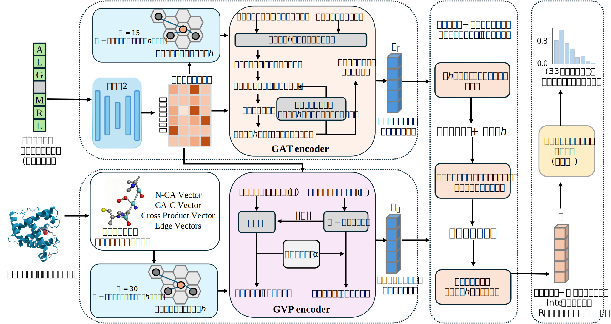
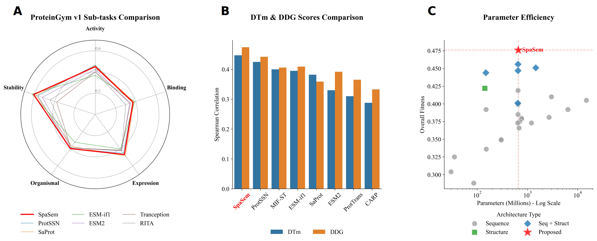

## Introduction

In this study, we proposed a novel dual-stream multi-modal framework, SpaSem (Spatial-Semantic Integration), for zero-shot protein mutation effect prediction. Unlike previous methods that rely exclusively on sequence data or static physical contact graphs, SpaSem explicitly integrates continuous geometric constraints with dynamic, long-range evolutionary correlations. By employing a *SpatialGlue*-inspired cross-modality attention mechanism, the framework adaptively fuses spatial and semantic representations based on the local microenvironment to efficiently learn the complex sequence-structure-function mapping space. This architecture can directly perform high-precision zero-shot inferences without the need for computationally expensive mutant structure modeling or downstream fine-tuning. 



## Results

### Downloads

- ProteinGym: The pdb files folded by ColabFold 1.5 can be downloaded from https://huggingface.co/datasets/tyang816/ProteinGym_v1/resolve/main/ProteinGym_v1_AlphaFold2_PDB.zip
- **DTM** and **DDG** dataset can be found in [`data/DTM`](https://github.com/tyang816/ProtSSN/tree/master/data/DTM) and [`data/DDG`](https://github.com/tyang816/ProtSSN/tree/master/data/DDG)

### Paper Results

We selected three of the most authoritative benchmark datasets in the field of protein engineering for evaluation: ProteinGym, $\Delta T_m$, and $\Delta\Delta G$. We compared SpaSem with a comprehensive set of sequence-only models, structure-based encoders, and advanced sequence-structure multimodal frameworks. It is important to note that the performance metrics for all baseline models reported in our evaluations were directly adopted from the robust benchmarks established by Tan et al. in the ProtSSN study. Spearman's rank correlation coefficient was utilized as the standard evaluation metric.

| Model                        | Version        | Params    | DTm       | DDG       | ProteinGym v1 |           |            |            |           |                 |
| ---------------------------- | -------------- | --------- | --------- | --------- | ------------- | --------- | ---------- | ---------- | --------- | --------------- |
|                              |                | (million) |           |           | Activity      | Binding   | Expression | Organismal | Stability | Overall fitness |
| Sequence encoder             |                |           |           |           |               |           |            |            |           |                 |
| RITA                         | small          | 30        | 0.122     | 0.143     | 0.294         | 0.275     | 0.337      | 0.327      | 0.289     | 0.304           |
|                              | medium         | 300       | 0.131     | 0.188     | 0.352         | 0.274     | 0.406      | 0.371      | 0.348     | 0.350           |
|                              | large          | 680       | 0.213     | 0.236     | 0.359         | 0.291     | 0.422      | 0.374      | 0.383     | 0.366           |
|                              | xlarge         | 1,200     | 0.221     | 0.264     | 0.402         | 0.302     | 0.423      | 0.387      | 0.445     | 0.373           |
| ProGen2                      | small          | 151       | 0.135     | 0.194     | 0.333         | 0.275     | 0.384      | 0.337      | 0.349     | 0.336           |
|                              | medium         | 764       | 0.226     | 0.214     | 0.393         | 0.296     | 0.436      | 0.381      | 0.396     | 0.380           |
|                              | base           | 764       | 0.197     | 0.253     | 0.396         | 0.294     | 0.444      | 0.379      | 0.383     | 0.379           |
|                              | large          | 2700      | 0.181     | 0.226     | 0.406         | 0.294     | 0.429      | 0.379      | 0.396     | 0.381           |
|                              | xlarge         | 6400      | 0.232     | 0.270     | 0.402         | 0.302     | 0.423      | 0.387      | 0.445     | 0.392           |
| ProtTrans                    | bert           | 420       | 0.268     | 0.313     | -             | -         | -          | -          | -         | -               |
|                              | bert_bfd       | 420       | 0.217     | 0.293     | -             | -         | -          | -          | -         | -               |
|                              | t5_xl_uniref50 | 3000      | 0.310     | 0.365     | -             | -         | -          | -          | -         | -               |
|                              | t5_xl_bfd      | 3000      | 0.239     | 0.334     | -             | -         | -          | -          | -         | -               |
| Tranception                  | small          | 85        | 0.119     | 0.169     | 0.287         | 0.349     | 0.319      | 0.270      | 0.258     | 0.288           |
|                              | medium         | 300       | 0.189     | 0.256     | 0.349         | 0.285     | 0.409      | 0.362      | 0.342     | 0.349           |
|                              | large          | 700       | 0.197     | 0.284     | 0.401         | 0.289     | 0.415      | 0.389      | 0.381     | 0.375           |
| ESM-1v                       | -              | 650       | 0.279     | 0.266     | 0.390         | 0.268     | 0.431      | 0.362      | 0.476     | 0.385           |
| ESM-1b                       | -              | 650       | 0.271     | 0.343     | 0.428         | 0.289     | 0.427      | 0.351      | 0.500     | 0.399           |
| ESM2                         | t12            | 35        | 0.214     | 0.216     | 0.314         | 0.292     | 0.364      | 0.218      | 0.439     | 0.325           |
|                              | t30            | 150       | 0.288     | 0.317     | 0.391         | 0.328     | 0.425      | 0.305      | 0.510     | 0.392           |
|                              | t33            | 650       | 0.330     | 0.392     | 0.425         | 0.339     | 0.415      | 0.338      | 0.523     | 0.419           |
|                              | t36            | 3000      | 0.327     | 0.351     | 0.417         | 0.322     | 0.425      | 0.379      | 0.509     | 0.410           |
|                              | t48            | 15,000    | 0.311     | 0.252     | 0.405         | 0.318     | 0.425      | 0.388      | 0.488     | 0.405           |
| CARP                         | -              | 640       | 0.288     | 0.333     | 0.395         | 0.274     | 0.419      | 0.364      | 0.414     | 0.373           |
| Structure encoder            |                |           |           |           |               |           |            |            |           |                 |
| ESM-if1                      | -              | 142       | 0.395     | 0.409     | 0.368         | **0.392** | 0.403      | 0.324      | **0.624** | 0.422           |
| Sequence + structure encoder |                |           |           |           |               |           |            |            |           |                 |
| MIF-ST                       | -              | 643       | 0.400     | 0.406     | 0.390         | 0.323     | 0.432      | 0.373      | 0.486     | 0.401           |
| SaProt                       | masked         | 650       | 0.382     | -         | 0.459         | 0.382     | **0.485**  | 0.371      | 0.583     | 0.456           |
|                              | unmasked       | 650       | 0.376     | 0.359     | 0.450         | 0.376     | 0.460      | 0.372      | 0.577     | 0.447           |
| ProtSSN                      | k20_h512       | 148       | 0.419     | 0.442     | 0.458         | 0.371     | 0.436      | 0.387      | 0.566     | 0.444           |
|                              | Ensemble       | 1467      | 0.425     | 0.440     | **0.466**     | 0.371     | 0.451      | **0.398**  | 0.568     | 0.451           |
| **SpaSem**                   | -              | 657       | **0.447** | **0.474** | 0.450         | 0.373     | 0.467      | 0.397      | 0.608     | **0.476**       |



Beyond theoretical benchmarks, we rigorously evaluated the clinical utility of SpaSem using human variant data from the ClinVar database. The framework distinguished pathogenic from benign variants with exceptional accuracy, achieving perfect classification on disease-associated targets such as PPARG (AUC = 1.00) and NPC1 (AUC = 1.00). Crucially, our purely computational model significantly outperformed high-cost experimental deep mutational scanning (DMS) assays on challenging genes, including the tumor suppressor PTEN (AUC = 0.98 vs. DMS 0.83) and the Parkinson's-related PRKN (AUC = 0.92 vs. DMS 0.69). These results establish SpaSem as a highly reliable and scalable tool for high-throughput clinical variant pathogenicity interpretation.  


## Requirement

### Conda Enviroment

Please make sure you have installed **[Anaconda3](https://www.anaconda.com/download)** or **[Miniconda3](https://docs.conda.io/projects/miniconda/en/latest/)**.

**Enviroment.**

```
conda env create -f environment.yaml
conda activate SpaSem
```

### Hardware

We implemented the SpaSem framework using the PyTorch library and executed the training process on a high-performance workstation equipped with an Intel i9-14900K CPU and a single NVIDIA GeForce RTX 4090 GPU (24GB VRAM). 

| **hardware**        | **type**                            | **numbers** |
| ------------------- | ----------------------------------- | ----------- |
| CPU                 | Intel(R) Core(TM) i9-14900K         | 1           |
| GPU                 | NVIDIA GeForce RTX 4090 (24GB VRAM) | 1           |
| System Memory (RAM) | 128G                                | 1           |

### Hyperparameters for multi-modal pre-training

To construct the semantic stream, the pre-trained ESM-2 model (650M parameters) was utilized as the backbone. To prevent catastrophic forgetting and mitigate GPU memory consumption during dense multi-modal graph processing, the weights of the ESM-2 encoder were strictly frozen. Only the task-specific architectural components—the GVP geometric encoder, the GAT semantic layers, the cross-modality attention fusion module, and the prediction head—were kept trainable. Both streams were configured with a uniform hidden dimension of 128 to facilitate symmetrical dual-attention fusion, and a dropout rate of 0.1 was applied across the network to prevent overfitting.

The framework was trained using the structure-aware Masked Language Modeling (MLM) objective with a random masking probability of 15%. To rigorously calculate the reconstruction loss, the Cross-Entropy criterion was customized to strictly ignore non-masked residue positions (assigned an index of -100). This ensures gradients are derived exclusively from the perturbed microenvironments, strictly maintaining the zero-shot paradigm without exposure to experimental mutational labels.

Optimization was performed using the AdamW optimizer with a base learning rate of 1e-4) and a weight decay coefficient of 0.01. Due to the substantial memory footprint of parallel dual-stream message passing, we employed a gradient accumulation strategy over 2 steps to maintain a stable effective batch size of 16. The data loading process was accelerated using 8 parallel worker threads, and the entire framework was pre-trained for 65 epochs.

| **parameter**               | **values** |
| --------------------------- | ---------- |
| Batch size                  | 16         |
| Gradient accumulation steps | 2          |
| Learning rate               | 1e-4       |
| Epochs                      | 65         |
| Optimizer                   | AdamW      |
| Number of workers           | 8          |
| Weight decay                | 0.01       |


## Quickstart

#### 1. Data Preprocessing

Extract 3D coordinates and 3Di structural tokens from PDB files to build KNN graphs:

```
PYTHONPATH=. nohup python scripts/1_preprocess_graphs.py \
    --input_dir /mnt/data/jzhang/data/alphafold_swissprot/v6_extracted \
    --output_dir data/processed_graphs \
    --num_workers 16 \
    > preprocess_run.log 2>&1 &

tail -f preprocess_run.log
```

#### 2. Pre-training (Masked Language Modeling)

Pre-train the SpaSem model using the processed graphs. You can easily adjust the model capacity and graph topology through command-line arguments:

```
PYTHONPATH=. nohup python scripts/2_pretrain.py \
    --train_path ./data/processed_graphs \
    --esm_model_path ./pretrained_models/esm2_t33_650M_UR50D \
    --output_dir experiments/test1 \
    --epochs 65 \
    --gvp_layers 6 \
    --batch_size 16 \
    --accum_steps 2 \
    --lr 1e-4 \
    --num_workers 8 \
    --gnn_type gvp \
    --alpha 0.2 \
    > experiments/test1/train.log 2>&1 &
    
tail -f experiments/test1/train.log
```

#### 3. Zero-shot Benchmarking

Evaluate the pre-trained model on downstream tasks without any fine-tuning.

**For DTm / DDG Thermodynamics Benchmarks:**

```
PYTHONPATH=. nohup python scripts/4_benchmark_dtm.py \
    --checkpoint experiments/test1/SpaSem_epoch_65.pt \
    --dtm_root ./data/DTM/DATASET \
    --esm_model ./pretrained_models/esm2_t33_650M_UR50D \
    --output_csv experiments/test1/benchmark_results_dual_stream.csv \
    > experiments/test1/benchmark.log 2>&1 &

# 实时查看评测进度
tail -f experiments/test1/benchmark.log
```

**For ProteinGym v1 Benchmark:**

```
YTHONPATH=. nohup python scripts/5_benchmark_proteingym.py \
    --json_file protssn_experiment_plan.json \
    --checkpoint experiments/test1/SpaSem_epoch_65.pt \
    --output_csv experiments/test1/table3_breakdown.csv \
    --esm_model ./pretrained_models/esm2_t33_650M_UR50D \
    --gvp_layers 6 \
    > experiments/test1/table3_run.log 2>&1 &

tail -f experiments/test1/table3_run.log
```

## Project Structure

```
SpaSem/
├── configs/                        # Configuration files directory
│   ├── base_config.yaml            # Base model and training configurations
│   ├── inference_zeroshot.yaml     # Zero-shot inference configurations
│   └── train_mlm.yaml              # Specific configurations for MLM pre-training
├── data/                           # Data directory (raw PDBs, processed graphs, and benchmarks)
├── experiments/                    # Experiment outputs (model checkpoints and training logs)
├── scripts/                        # Core execution scripts
│   ├── 1_preprocess_graphs.py      # Data preprocessing
│   ├── 2_pretrain.py               # Main model pre-training script (MLM)
│   ├── 3_zero_shot_score.py        # Zero-shot scoring script for single variants
│   ├── 4_benchmark_dtm.py          # DTm/DDG thermodynamics benchmarking script
│   ├── 5_benchmark_proteingym.py   # ProteinGym v1 comprehensive benchmarking script
├── src/                            # Core source code modules
│   ├── data/                       # Data loading and processing modules
│   │   ├── collator.py             # PyG batching and dynamic masking logic
│   │   ├── dataset.py              # PyTorch dataset classes
│   │   └── graph_builder.py        # KNN graph builder
│   ├── modeling/                   # Neural network architecture definitions
│   │   ├── esm_wrapper.py          # Frozen ESM-2 semantic feature extractor
│   │   ├── fusion.py               # Multi-modal feature fusion module
│   │   ├── gvp_encoder.py          # Core GVP (Geometric Vector Perceptron) network
│   │   ├── spatial_glue_modules.py # spatial_glue_module code
│   │   └── SpaSem.py               # Top-level SpaSem main model
│   ├── loss.py                     # Loss function definitions (MaskedMLMLoss)
│   └── scoring.py                  # Core logic for zero-shot scoring (Log-Likelihood Ratio)
├── environment.yaml                # Conda cross-platform environment dependencies file
└── protssn_experiment_plan.json    # Experiment plans and benchmark configuration metadata
```

## Pre-trained Weights

We provide the pre-trained weights for the main SpaSem model, as well as the variant models used in our ablation studies. 

You can download all the model checkpoints from one drive and place them in the `./experiments/` directory.

### 1. Main Model

This is the primary full-parameter model with the complete multi-modal architecture used for the main results in the paper.

| Model             | Description                            |                        Download Link                         |
| :---------------- | :------------------------------------- | :----------------------------------------------------------: |
| **SpaSem (Full)** | The complete multi-modal architecture. | **[best_model](https://onedrive.live.com/?redeem=aHR0cHM6Ly8xZHJ2Lm1zL2YvYy9lNzY4ZmUxMDRlODMyYTE5L0lnQU84dmxmTWEzTFNxZVdNeTZfY0dxOEFkQm1kbUlDUWc5ZFZqeHI2TWF6TkpvP2U9YjkxYW84&id=E768FE104E832A19%21s403eb99cf6674721b3feebb05a2cd375&cid=E768FE104E832A19&sb=name&sd=1)** |

### 2. Ablation Study Models

To facilitate reproducibility of our ablation experiments, we also provide the weights for the model variants.

| Model Variant              | Download Link                                                |
| :------------------------- | :----------------------------------------------------------- |
| **SpaSem (Semantic-only)** | [model](https://onedrive.live.com/?redeem=aHR0cHM6Ly8xZHJ2Lm1zL2YvYy9lNzY4ZmUxMDRlODMyYTE5L0lnQU84dmxmTWEzTFNxZVdNeTZfY0dxOEFkQm1kbUlDUWc5ZFZqeHI2TWF6TkpvP2U9YjkxYW84&id=E768FE104E832A19%21s54ebd14428084176adda383b9c206475&cid=E768FE104E832A19&sb=name&sd=1) |
| **SpaSem (Spatial-only)**  | [model](https://onedrive.live.com/?redeem=aHR0cHM6Ly8xZHJ2Lm1zL2YvYy9lNzY4ZmUxMDRlODMyYTE5L0lnQU84dmxmTWEzTFNxZVdNeTZfY0dxOEFkQm1kbUlDUWc5ZFZqeHI2TWF6TkpvP2U9YjkxYW84&id=E768FE104E832A19%21s5b646b88dd194ebba6bb090f8410e8d9&cid=E768FE104E832A19&sb=name&sd=1) |
| **SpaSem (KK: 10, 15)**    | [model](https://onedrive.live.com/?redeem=aHR0cHM6Ly8xZHJ2Lm1zL2YvYy9lNzY4ZmUxMDRlODMyYTE5L0lnQU84dmxmTWEzTFNxZVdNeTZfY0dxOEFkQm1kbUlDUWc5ZFZqeHI2TWF6TkpvP2U9YjkxYW84&id=E768FE104E832A19%21s60ced33393c44ddeb43ca72772491405&cid=E768FE104E832A19&sb=name&sd=1) |
| **SpaSem (KK: 20, 15)**    | [model](https://onedrive.live.com/?redeem=aHR0cHM6Ly8xZHJ2Lm1zL2YvYy9lNzY4ZmUxMDRlODMyYTE5L0lnQU84dmxmTWEzTFNxZVdNeTZfY0dxOEFkQm1kbUlDUWc5ZFZqeHI2TWF6TkpvP2U9YjkxYW84&id=E768FE104E832A19%21s66f459f9ad5c43a2947e6da52a70c185&cid=E768FE104E832A19&sb=name&sd=1) |
| **SpaSem (KK: 30, 25)**    | [model](https://onedrive.live.com/?redeem=aHR0cHM6Ly8xZHJ2Lm1zL2YvYy9lNzY4ZmUxMDRlODMyYTE5L0lnQU84dmxmTWEzTFNxZVdNeTZfY0dxOEFkQm1kbUlDUWc5ZFZqeHI2TWF6TkpvP2U9YjkxYW84&id=E768FE104E832A19%21sb5cdb07368e4494eb1ba457abb3c4027&cid=E768FE104E832A19&sb=name&sd=1) |
| **SpaSem (KK: 30, 35)**    | [model](https://onedrive.live.com/?redeem=aHR0cHM6Ly8xZHJ2Lm1zL2YvYy9lNzY4ZmUxMDRlODMyYTE5L0lnQU84dmxmTWEzTFNxZVdNeTZfY0dxOEFkQm1kbUlDUWc5ZFZqeHI2TWF6TkpvP2U9YjkxYW84&id=E768FE104E832A19%21s73a303607b014fe1858fd5e44e17acc4&cid=E768FE104E832A19&sb=name&sd=1) |
| **SpaSem (HH: 3, 2)**      | [model](https://onedrive.live.com/?redeem=aHR0cHM6Ly8xZHJ2Lm1zL2YvYy9lNzY4ZmUxMDRlODMyYTE5L0lnQU84dmxmTWEzTFNxZVdNeTZfY0dxOEFkQm1kbUlDUWc5ZFZqeHI2TWF6TkpvP2U9YjkxYW84&id=E768FE104E832A19%21s0aada8d632224bb4b2b7eb68839d3581&cid=E768FE104E832A19&sb=name&sd=1) |
| **SpaSem (HH: 9, 2)**      | [model](https://onedrive.live.com/?redeem=aHR0cHM6Ly8xZHJ2Lm1zL2YvYy9lNzY4ZmUxMDRlODMyYTE5L0lnQU84dmxmTWEzTFNxZVdNeTZfY0dxOEFkQm1kbUlDUWc5ZFZqeHI2TWF6TkpvP2U9YjkxYW84&id=E768FE104E832A19%21s13bbd313a9934d329f0f4030add802cd&cid=E768FE104E832A19&sb=name&sd=1) |
| **SpaSem (HH: 6, 1)**      | [model](https://onedrive.live.com/?redeem=aHR0cHM6Ly8xZHJ2Lm1zL2YvYy9lNzY4ZmUxMDRlODMyYTE5L0lnQU84dmxmTWEzTFNxZVdNeTZfY0dxOEFkQm1kbUlDUWc5ZFZqeHI2TWF6TkpvP2U9YjkxYW84&id=E768FE104E832A19%21scee429f9521149dd85f93039a061006b&cid=E768FE104E832A19&sb=name&sd=1) |
| **SpaSem(HH: 6, 3)**       | [model](https://onedrive.live.com/?redeem=aHR0cHM6Ly8xZHJ2Lm1zL2YvYy9lNzY4ZmUxMDRlODMyYTE5L0lnQU84dmxmTWEzTFNxZVdNeTZfY0dxOEFkQm1kbUlDUWc5ZFZqeHI2TWF6TkpvP2U9YjkxYW84&id=E768FE104E832A19%21s5a8528f673d14b6094d207c3b19b71a7&cid=E768FE104E832A19&sb=name&sd=1) |

> **Note:** If you are only interested in running the standard inference or evaluating on the ProteinGym benchmark, downloading the **Main Model** is sufficient.
